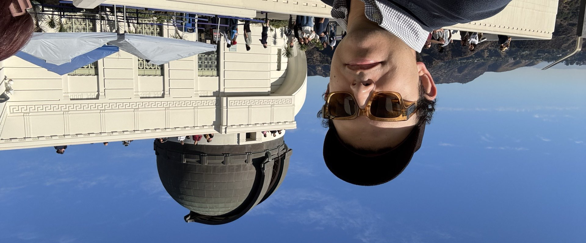
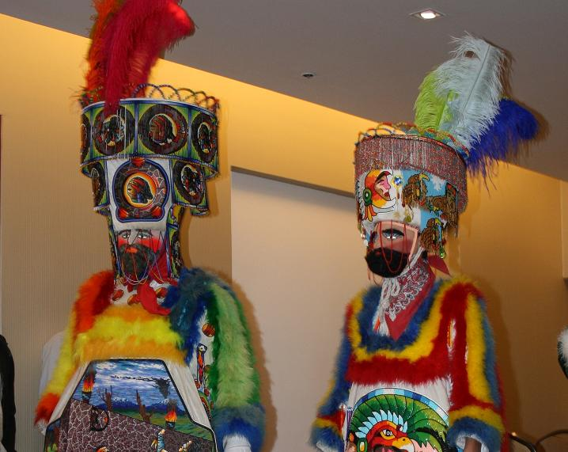
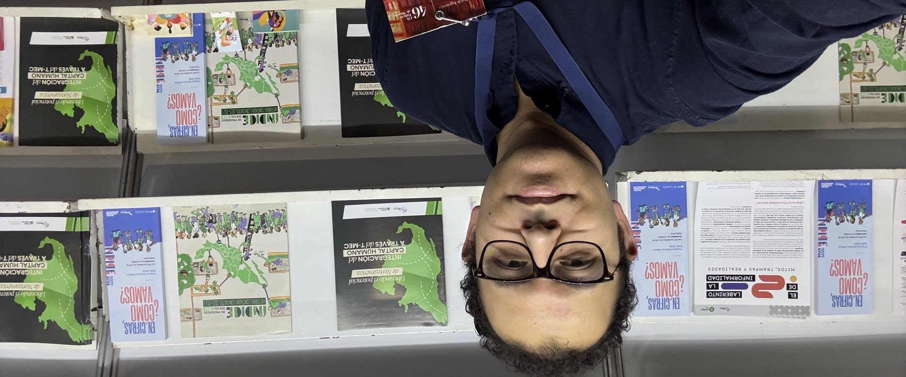
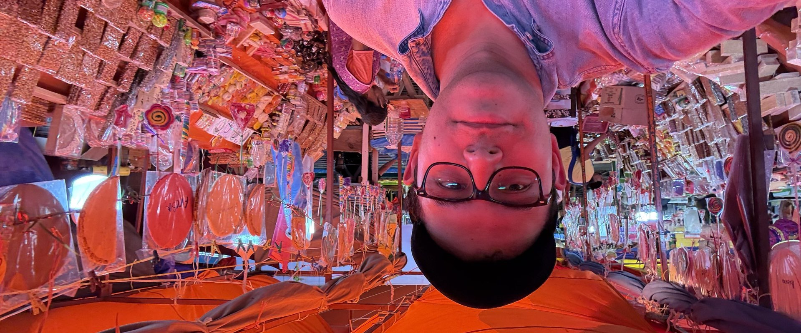

```{=html}
<style>
.polaroid {
  display: inline-block;
  background: #fff;
  padding: 14px 14px 44px 14px;
  box-shadow: 0 12px 28px rgba(0,0,0,.18), 0 2px 6px rgba(0,0,0,.10);
  transition: transform .3s ease;
  margin: 0;
  max-width: 260px;
  transform: rotate(var(--rot, 0deg));
}
.polaroid:hover { transform: rotate(0deg) scale(1.02); }
.polaroid img { display: block; width: 100%; height: auto; }
.polaroid figcaption {
  text-align: center;
  font-family: "Caveat", "Bradley Hand", "Segoe Script", cursive;
  color: #444;
  margin: 10px 4px 0;
  font-size: 1.1rem;
  line-height: 1.2;
}
.polaroid.hero     { float: right; max-width: 320px; margin: 0 0 1.5rem 1.75rem; }
.polaroid.chinelos { float: left;                     margin: .25rem 1.75rem 1rem 0; }

.photo-gallery {
  margin: 4rem auto 2rem;
  padding-top: 2.5rem;
  border-top: 1px solid rgba(128,128,128,.2);
}
.gallery-title {
  text-align: center;
  font-family: "Caveat", "Bradley Hand", "Segoe Script", cursive;
  font-size: 2rem;
  color: inherit;
  margin-bottom: 2rem;
}
.gallery-grid {
  display: flex;
  flex-wrap: wrap;
  gap: 2.5rem 1.75rem;
  justify-content: center;
  align-items: flex-start;
}
.gallery-grid .polaroid { max-width: 210px; }

@media (max-width: 640px) {
  .polaroid.hero,
  .polaroid.chinelos {
    float: none;
    display: block;
    max-width: 260px;
    margin: 0 auto 1.5rem;
  }
  .gallery-grid { gap: 2rem 1rem; }
  .gallery-grid .polaroid { max-width: 160px; }
}
</style>
```

::: {=html}
<figure class="polaroid hero" style="--rot: 3deg;">
  
  <figcaption>Griffith Observatory · LA</figcaption>
</figure>
:::

Hola.

Yo soy Jorge Juvenal Campos Ferreira, y este es mi blog personal.

Soy **Ingeniero en Irrigación** por la *Universidad Autónoma Chapingo* y **Maestro en Economía** por *El Colegio de México*. Actualmente mi trabajo se reparte entre la ciencia de datos aplicada, el periodismo de datos y la docencia universitaria:

- Hago ciencia de datos para problemas públicos y privados en [**Clave Igualdad**](https://claveigualdad.org).
- Colaboro con [**México, ¿Cómo Vamos?**](https://mexicocomovamos.mx) en proyectos como el [Índice de Progreso Social](https://mexicocomovamos.mx/indice-de-progreso-social/).
- Doy clases en el [**Tec de Monterrey**](https://tec.mx).
- Apoyo a la [**Fundación Novagob**](https://novagob.org) en el [Índice de Ciudades Sostenibles](https://ics.novagob.mx) y el Índice de Estados Sostenibles.
- Escribo la columna **Apuntes de datos** en [**ATiempo.TV**](https://atiempo.tv/author/juvenal-campos/), medio digital de Coahuila.

::: {=html}
<figure class="polaroid chinelos" style="--rot: -4deg;">
  
  <figcaption>Chinelos de Morelos</figcaption>
</figure>
:::

Soy originario del Estado de Morelos, me gusta brincar chinelo, comer Cecina de Yeca y decir "sí pues" cantadito. Mi pueblo se llama Ocuituco y se encuentra en la región de los altos de Morelos, pegado al volcán Popocatépetl, en esa parte del estado en la que ya no hace calor y tampoco tenemos albercas.

Mis hobbies son caminar, jugar videojuegos (Pokémon, la saga **Persona** de Atlus, Halo y Smash Bros), ir a correr/gimnasio, ver YouTube (un día sacaré mi canal de algo) y moverle al R, al HTML y al CSS (y de vez en cuando, al Python y al JS). También de vez en mes me veo alguna serie de Netflix o de anime japonés.

Este blog lo escribo principalmente motivado por la necesidad de dejar de ser solo un consumidor de contenido para pasar a generarlo. Aquí subo proyectos personales, tutoriales de R, análisis con datos públicos y, de vez en cuando, cosas de mi vida.

Si quieres escribirme para colaborar, dar clase o simplemente platicar sobre datos, puedes hacerlo por [correo](mailto:juvenal@claveigualdad.org) o desde la [sección de contacto](index.html#contacto).

Bienvenidos.

**Jorge Juvenal Campos Ferreira.**

```{=html}
<section class="photo-gallery">
  <h3 class="gallery-title">Otros momentos</h3>
  <div class="gallery-grid">
    <figure class="polaroid" style="--rot: -3deg;">
      
      <figcaption>Stanford</figcaption>
    </figure>
    <figure class="polaroid" style="--rot: 2.5deg;">
      
      <figcaption>México, ¿Cómo&nbsp;Vamos?</figcaption>
    </figure>
    <figure class="polaroid" style="--rot: 3.5deg;">
      
      <figcaption>Feria de Tepalcingo</figcaption>
    </figure>
    <figure class="polaroid" style="--rot: -2.5deg;">
      
      <figcaption>Visita al MIDE</figcaption>
    </figure>
  </div>
</section>
```

<small style="display:block; margin-top:3rem; color:#888; font-size:.85rem;">
Foto de chinelos: [Areygadas](https://commons.wikimedia.org/wiki/File:Chinelos_de_Morelos.JPG), Wikimedia Commons · [CC BY-SA 4.0](https://creativecommons.org/licenses/by-sa/4.0/).
</small>
