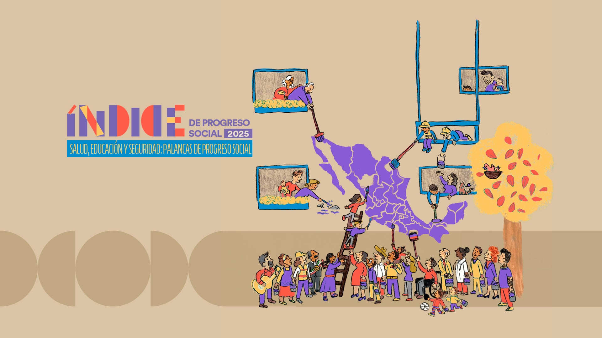
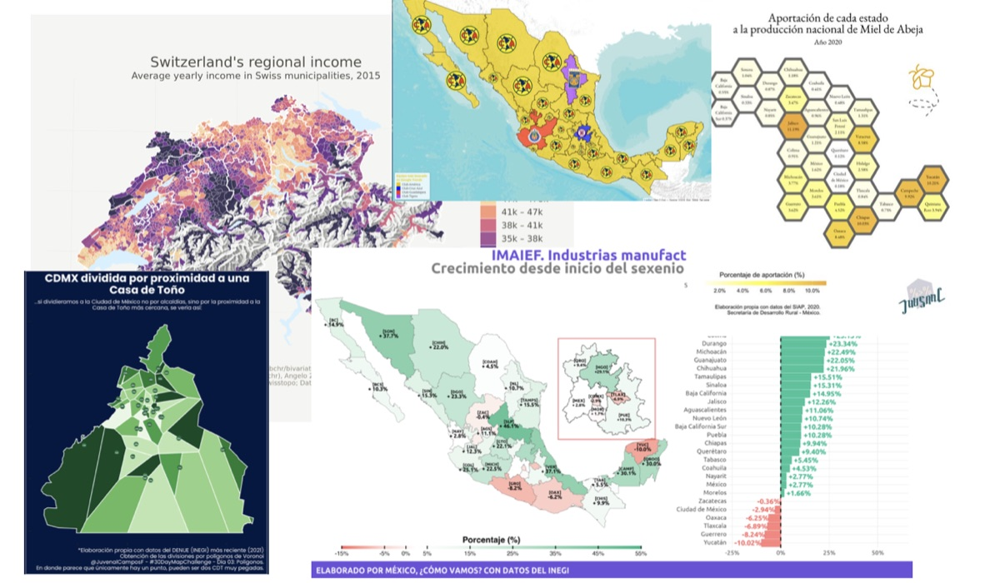
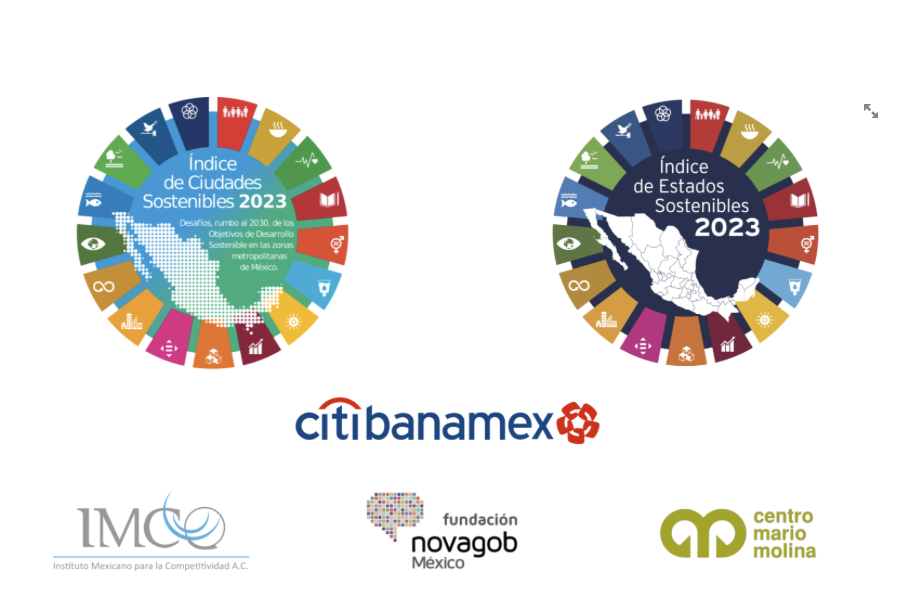

```{=html}
<!-- ============================================
     HERO CAROUSEL
     ============================================ -->
<section class="hero-section">
  <div class="carousel-container" aria-hidden="true">
    <!-- Solo la primera imagen carga de inmediato (con preload en el head);
         las demás se cargan vía JS (data-bg) cuando la página ya pintó. -->
    <div class="carousel-slide active" style="background-image: url('images/carousel/IMG_7831.jpg')"></div>
    <div class="carousel-slide" data-bg="images/carousel/IMG_7548.jpg"></div>
    <div class="carousel-slide" data-bg="images/carousel/IMG_6747.jpg"></div>
    <div class="carousel-slide" data-bg="images/carousel/IMG_5463.jpg"></div>
    <div class="carousel-slide" data-bg="images/carousel/IMG_5412.jpg"></div>
  </div>
  <div class="hero-overlay"></div>
  <div class="hero-content">
    <h1 class="hero-name">Jorge Juvenal<br>Campos Ferreira</h1>
    <p class="hero-tagline">Ciencia de datos · Periodismo de datos · Docencia</p>
    <a href="#socios" class="scroll-indicator" aria-label="Desplazar hacia abajo">
      <span>Conoce mi trabajo</span>
      <svg xmlns="http://www.w3.org/2000/svg" width="24" height="24" viewBox="0 0 24 24"
           fill="none" stroke="currentColor" stroke-width="2"
           stroke-linecap="round" stroke-linejoin="round">
        <polyline points="6 9 12 15 18 9"></polyline>
      </svg>
    </a>
  </div>
  <div class="carousel-dots"></div>
</section>

<!-- ============================================
     SOBRE MÍ
     ============================================ -->
<section id="sobre-mi" class="section">
  <div class="section-container">
    <h2 class="section-title">Sobre mí</h2>
    <p class="section-subtitle">Ciencia de datos aplicada, periodismo y docencia</p>
    <p style="max-width: 720px; margin: 0 auto 32px; text-align: center; line-height: 1.7; font-size: 1.05rem;">
      Ingeniero en Irrigación por <em>Chapingo</em> y Maestro en Economía por <em>El Colegio de México</em>.
      Trabajo entre la ciencia de datos aplicada, el periodismo de datos y la docencia
      universitaria — usando datos públicos para entender (y ayudar a explicar) lo que pasa en México.
    </p>
    <div class="blog-cta-wrapper">
      <a href="about.html" class="btn-primary-outline">Conocer más sobre mí →</a>
    </div>
  </div>
</section>

<!-- ============================================
     SOCIOS Y COLABORADORES
     ============================================ -->
<section id="socios" class="section section-alt">
  <div class="section-container">
    <h2 class="section-title">Socios y colaboradores</h2>
    <p class="section-subtitle">Organizaciones con las que colaboro</p>
    <div class="partners-grid">

      <a href="https://claveigualdad.org" class="partner-card glass-card"
         target="_blank" rel="noopener noreferrer">
        
        <span class="partner-name">Clave Igualdad</span>
      </a>

      <a href="https://mexicocomovamos.mx" class="partner-card glass-card"
         target="_blank" rel="noopener noreferrer">
        
        <span class="partner-name">México, ¿Cómo Vamos?</span>
      </a>

      <a href="https://tec.mx/es/ciencias-sociales" class="partner-card glass-card"
         target="_blank" rel="noopener noreferrer">
        
        <span class="partner-name">Tec de Monterrey</span>
      </a>

      <a href="https://novagob.org" class="partner-card glass-card"
         target="_blank" rel="noopener noreferrer">
        
        <span class="partner-name">Fundación Novagob</span>
      </a>

      <a href="https://atiempo.tv/author/juvenal-campos/" class="partner-card glass-card"
         target="_blank" rel="noopener noreferrer">
        
        <span class="partner-name">ATiempo.TV</span>
      </a>

    </div>
  </div>
</section>

<!-- ============================================
     PROYECTOS DESTACADOS
     ============================================ -->
<section id="proyectos" class="section">
  <div class="section-container">
    <h2 class="section-title">Proyectos destacados</h2>
    <p class="section-subtitle">Una selección de mi trabajo reciente</p>
    <div class="projects-grid">

      <!-- Proyecto 1: Índice de Progreso Social -->
      <a href="https://mexicocomovamos.mx/indice-de-progreso-social/" class="project-card glass-card" target="_blank" rel="noopener noreferrer">
        
        <div class="project-info">
          <div class="project-tags">
            <span class="tag">Índice</span>
            <span class="tag">Calidad de vida</span>
          </div>
          <h3 class="project-title">Índice de progreso social</h3>
          <p class="project-desc">
            Elaborado como parte del equipo de México, ¿Cómo vamos?, el Índice de Progreso Social es una medida que permite medir la calidad de vida de las personas en las 32 entidades de México.
          </p>
          <span class="project-link">Ver proyecto →</span>
        </div>
      </a>

      <!-- Proyecto 2: Artículos ATiempo.TV -->
      <a href="https://atiempo.tv/author/juvenal-campos/" class="project-card glass-card" target="_blank" rel="noopener noreferrer">
        
        <div class="project-info">
          <div class="project-tags">
            <span class="tag">Periodismo de datos</span>
            <span class="tag">IA</span>
          </div>
          <h3 class="project-title">Apuntes de datos en ATiempo.TV</h3>
          <p class="project-desc">
            Publicaciones sobre IA y análisis de datos publicados en ATiempo.TV, medio digital de Coahuila, México.
          </p>
          <span class="project-link">Ver proyecto →</span>
        </div>
      </a>

      <!-- Proyecto 3: Presentaciones -->
      <a href="https://juvecampos.github.io/presentaciones/" class="project-card glass-card" target="_blank" rel="noopener noreferrer">
        
        <div class="project-info">
          <div class="project-tags">
            <span class="tag">Docencia</span>
            <span class="tag">Presentaciones</span>
          </div>
          <h3 class="project-title">Presentaciones</h3>
          <p class="project-desc">
            Repositorio de presentaciones elaboradas para clases, eventos y conferencias.
          </p>
          <span class="project-link">Ver proyecto →</span>
        </div>
      </a>

      <!-- Proyecto 4: Índice de Ciudades Sostenibles -->
      <a href="https://ics.novagob.mx" class="project-card glass-card" target="_blank" rel="noopener noreferrer">
        
        <div class="project-info">
          <div class="project-tags">
            <span class="tag">Índice</span>
            <span class="tag">ODS</span>
          </div>
          <h3 class="project-title">Índice de ciudades sostenibles 2024</h3>
          <p class="project-desc">
            El Índice de Ciudades Sostenibles y el Índice de Estados Sostenibles miden el avance de las ciudades y las entidades federativas de México hacia el cumplimiento de los Objetivos de Desarrollo Sostenible.
          </p>
          <span class="project-link">Ver proyecto →</span>
        </div>
      </a>

    </div>
  </div>
</section>
```

<!-- ============================================
     ARTÍCULOS / BLOG (Quarto Listing)
     ============================================ -->

::::: {.section .blog-section .section-alt #articulos}
:::: {.section-container}

```{=html}
<h2 class="section-title">Artículos recientes</h2>
<p class="section-subtitle">Tutoriales, análisis y reflexiones sobre ciencia de datos</p>
```

::: {#articulos-recientes}
:::

```{=html}
<div class="blog-cta-wrapper">
  <a href="posts.html" class="btn-primary-outline">Ver todos los artículos →</a>
</div>
```

::::
:::::

```{=html}
<!-- ============================================
     CONTACTO — Netlify Forms
     ============================================ -->
<section id="contacto" class="section contact-section">
  <div class="section-container">
    <h2 class="section-title">Contacto</h2>
    <p class="section-subtitle">¿Tienes alguna pregunta o propuesta? Escríbeme</p>

    <form
      name="contacto"
      method="POST"
      data-netlify="true"
      netlify-honeypot="bot-field"
      action="/gracias.html"
      class="contact-form"
    >
      <input type="hidden" name="form-name" value="contacto" />
      <p class="honeypot-field">
        <label>No llenes esto: <input name="bot-field" /></label>
      </p>

      <div class="form-row">
        <div class="form-group">
          <label for="nombre">Nombre</label>
          <input type="text" id="nombre" name="nombre" required placeholder="Tu nombre" />
        </div>
        <div class="form-group">
          <label for="email">Email</label>
          <input type="email" id="email" name="email" required placeholder="tu@email.com" />
        </div>
      </div>

      <div class="form-group">
        <label for="asunto">Asunto</label>
        <input type="text" id="asunto" name="asunto" required placeholder="¿Sobre qué quieres hablar?" />
      </div>

      <div class="form-group">
        <label for="mensaje">Mensaje</label>
        <textarea id="mensaje" name="mensaje" rows="6" required placeholder="Escribe tu mensaje aquí..."></textarea>
      </div>

      <div class="form-submit">
        <button type="submit" class="btn-submit">Enviar mensaje</button>
      </div>
    </form>
  </div>
</section>
```
